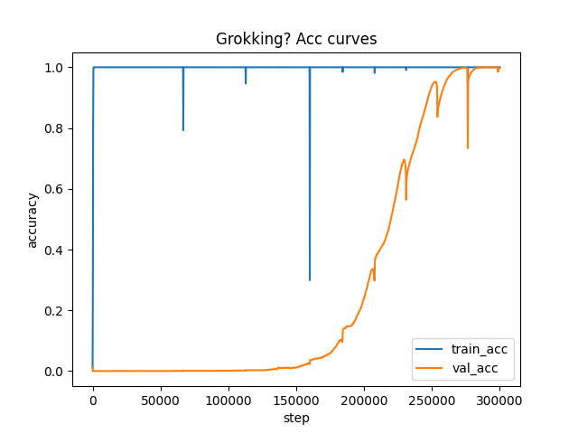

# MLP Grokking On Modular Addition (p=97)

## 1. Background

This experiment studies **grokking**: a training dynamic where a model quickly achieves near-perfect training accuracy (memorization), while validation accuracy remains near chance (or even worse-than-chance) for a long time, and then later transitions sharply to strong generalization after extended optimization.

We focus on a small **algorithmic dataset** (modular addition), which provides a controlled setting to measure:

- How quickly an overparameterized network can fit a finite training set.
- Whether/when it transitions to a structured solution that generalizes to unseen inputs.
- How the timing of this transition depends on training-set size.

Relevant references:

- Power et al. (2022), *Grokking: Generalization Beyond Overfitting on Small Algorithmic Datasets*: https://arxiv.org/abs/2201.02177
- Nanda et al. (2023), *Progress measures for grokking via mechanistic interpretability*: https://arxiv.org/abs/2301.05217

## 2. Methodology And Setup

### 2.1 Dataset

Code: `src/mlp/main.py`

- Choose a prime modulus `p` (here `p = 97`).
- Generate the full set of input pairs `(a, b)` where `a, b in {0, ..., p-1}`.
- Labels are modular addition:

```text
y = (a + b) mod p
```

- Total dataset size is `p^2 = 97^2 = 9409` examples.

### 2.2 Train/Validation Split (Unseen Pairs)

- A random permutation of the 9409 pairs is created.
- The first `train_frac * 9409` pairs are used for training; the remainder are validation.
- **Validation corresponds to unseen pairs** (not unseen values of `a` or `b`).

This split is a direct test of whether the model learns the underlying modular rule, rather than memorizing specific training inputs.

### 2.3 Model: Embedding + MLP

Code: `src/mlp/main.py` (class `MLP`)

- Two integers `(a, b)` are embedded via a learned embedding table:
  - `Embedding(p, embed_dim)` with `embed_dim = 128`
- The embeddings for `a` and `b` are concatenated into a 256-dim vector.
- This vector is passed through a depth-3 MLP with ReLU nonlinearity:

```text
[emb(a); emb(b)] (256)
  -> Linear(256, 256) -> ReLU
  -> Linear(256, 256) -> ReLU
  -> Linear(256, p)
```

Hyperparameters used across runs (fixed except `train_frac`, `steps`, `eval_every`, and one seed):

- `p = 97`
- `embed_dim = 128`
- `hidden_dim = 256`
- `depth = 3`

### 2.4 Training

- Optimizer: AdamW
- Learning rate: `lr = 1e-3`
- Weight decay: `weight_decay = 1e-2`
- Batch size: `256`
- Mini-batches are sampled uniformly with replacement from the training set.

### 2.5 Evaluation And Logging

- Every `eval_every` steps, the code evaluates **full-batch** training and validation loss/accuracy.
- Metrics are appended to `runs/.../metrics.jsonl` as:

```json
{"step": ..., "train_loss": ..., "train_acc": ..., "val_loss": ..., "val_acc": ...}
```

- Curves are saved as `losses.png` and `accuracy.png` per run.

## 3. Results

### 3.1 Overview: Two-Phase Learning

Across runs, the training dynamics consistently show:

1. **Memorization phase**: training accuracy rises to ~100% in the first ~500-800 steps.
2. **Delayed generalization phase (grokking)**:
   - validation accuracy stays near 0% for a long time (often worse-than-chance)
   - then transitions sharply to near-100% after extended training

A striking example is `train_frac = 0.25`:

- At step 500, the model already has `train_acc = 1.0` but `val_acc ~ 0.00028` (0.028%) with very high validation loss.
- Much later, validation snaps to ~1.0 and validation loss collapses near zero.

This is characteristic grokking behavior: the model first fits a brittle solution that fails on unseen pairs, then later finds a structured rule that generalizes.

### 3.2 Key Runs And Grokking Time

We define **grokking time** as the first evaluation step where `val_acc >= 0.99`.

Table: summary of all recorded runs.

| Run dir | train_frac | seed | total steps | best val acc | step(val_acc>=0.99) | Notes |
| --- | ---:| ---:| ---:| ---:| ---:| --- |
| `runs/train_frac/20260122_085304` | 0.25 | 0 | 1,500,000 | 1.000 | 1,126,000 | Clear grokking |
| `runs/seed/20260122_095242` | 0.25 | 42 | 1,200,000 | 1.000 | 1,054,000 | Seed shifts timing |
| `runs/train_frac/20260122_073903` | 0.30 | 0 | 600,000 | 0.801 | n/a | Stopped before grokking |
| `runs/train_frac/20260122_200706` | 0.30 | 0 | 800,000 | 1.000 | 637,000 | Extension reaches grokking |
| `runs/train_frac/20260121_094638` | 0.35 | 0 | 500,000 | 1.000 | 447,500 | Clear grokking |
| `runs/train_frac/20260121_093150` | 0.40 | 0 | 400,000 | 1.000 | 340,800 | Clear grokking |
| `runs/train_frac/20260121_092213` | 0.45 | 0 | 300,000 | 1.000 | 267,400 | Clear grokking |
| `runs/train_frac/20260121_082404` | 0.50 | 0 | 200,000 | 0.902 | n/a | Likely undertrained |

### 3.3 Figures

Each run saves loss/accuracy curves. Representative examples:

- `train_frac = 0.25` (very delayed generalization):
  - Accuracy: `runs/train_frac/20260122_085304/accuracy.png`
  - Loss: `runs/train_frac/20260122_085304/losses.png`

- `train_frac = 0.45` (faster grokking):
  - Accuracy: `runs/train_frac/20260121_092213/accuracy.png`
  - Loss: `runs/train_frac/20260121_092213/losses.png`

If viewing this README in a markdown renderer that supports relative images:




### 3.4 Train Fraction Strongly Controls Grokking Time

As `train_frac` increases, the grokking transition happens much earlier.

Using only the runs that reached `val_acc >= 0.99` (train_frac 0.25-0.45), a simple power-law fit summarizes the trend:

```text
step_to_val99  ~  37,316 * train_frac^(-2.41)
R^2 ~ 0.993
```

Interpretation:

- Grokking time decreases faster than linearly with training fraction.
- Small training sets incur a steep optimization cost: dropping from 0.45 -> 0.25 increases grokking time by ~4x.

## 4. Insights And Conclusions

1. **MLPs can grok modular addition.**
   The phenomenon is not limited to transformer architectures: an embedding + ReLU MLP shows a clear delayed-generalization transition on unseen pairs.

2. **Memorization is almost immediate; generalization is delayed.**
   Training accuracy reaches ~100% within ~500-800 steps across all runs, while validation can remain near-zero for hundreds of thousands of steps.

3. **Validation can become worse-than-chance during memorization.**
   Early in training (after the model interpolates), validation loss can become very large and validation accuracy can drop below chance, indicating confident but systematically wrong predictions on unseen inputs.

4. **Train fraction is a primary control knob for grokking time.**
   With all other hyperparameters fixed, larger training sets reduce the optimization time needed before generalization emerges.

5. **Some runs likely need longer training to complete the transition.**
   The `train_frac = 0.50` run ends at 0.902 validation accuracy at 200k steps; given the trend, extending the step budget may push it to full grokking.

## 5. Suggestions For Future Work

To deepen and generalize the findings without changing the core task:

1. **Multi-seed confidence intervals for grokking time.**
   Run 5-10 seeds per `train_frac` and report variability of `step_to_val99`.

2. **Regularization sweeps (especially weight decay).**
   Keep `train_frac` fixed and sweep `weight_decay` (e.g., 0, 1e-4, 1e-3, 1e-2, 1e-1) to identify regimes where grokking disappears, accelerates, or becomes more gradual.

3. **Model capacity sweeps.**
   Vary `embed_dim`, `hidden_dim`, and `depth` to test whether grokking time correlates with parameter count or with specific architectural bottlenecks.

4. **Mechanistic diagnostics.**
   Add lightweight probes over training:
   - weight norms / embedding norms
   - simple spectral measures of learned embeddings
   The goal is to find continuous progress indicators that anticipate the accuracy jump.

5. **Harder generalization splits (optional extension).**
   Keep unseen pairs as the main benchmark, but add structured holdouts (e.g., hold out all pairs with `a` in a subset) to distinguish true rule learning from interpolation on a dense grid.

## Repro Notes

Configs live in `src/mlp/configs/`.

Example command pattern (see project-level instructions):

```bash
uv run --experiment train_frac --config src/mlp/configs/train_frac_25.yaml
```

Run outputs will be created under `runs/<experiment>/<timestamp>/`.
